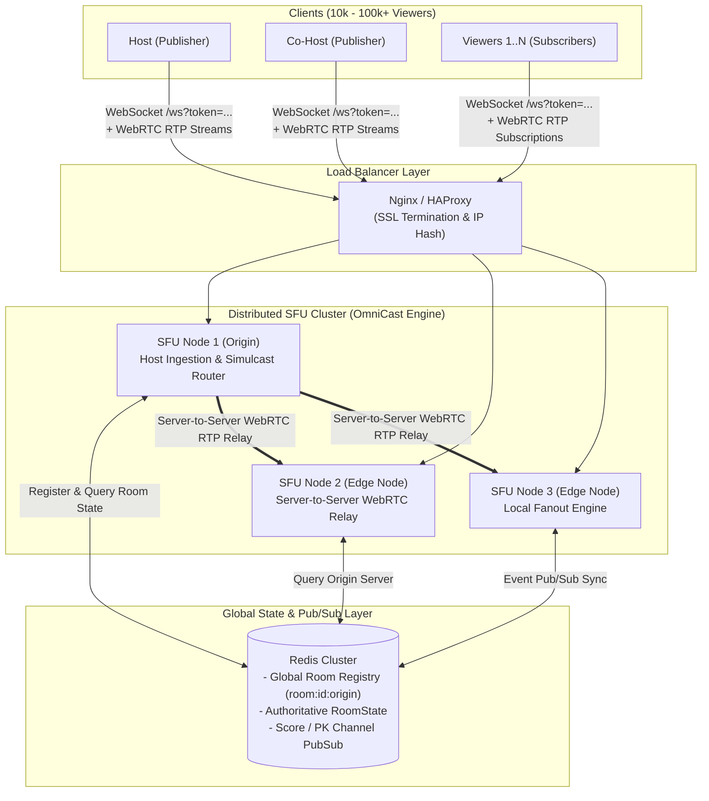
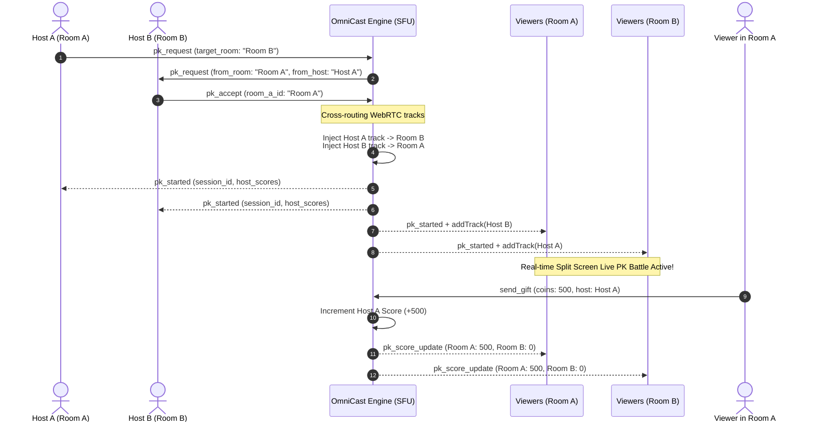
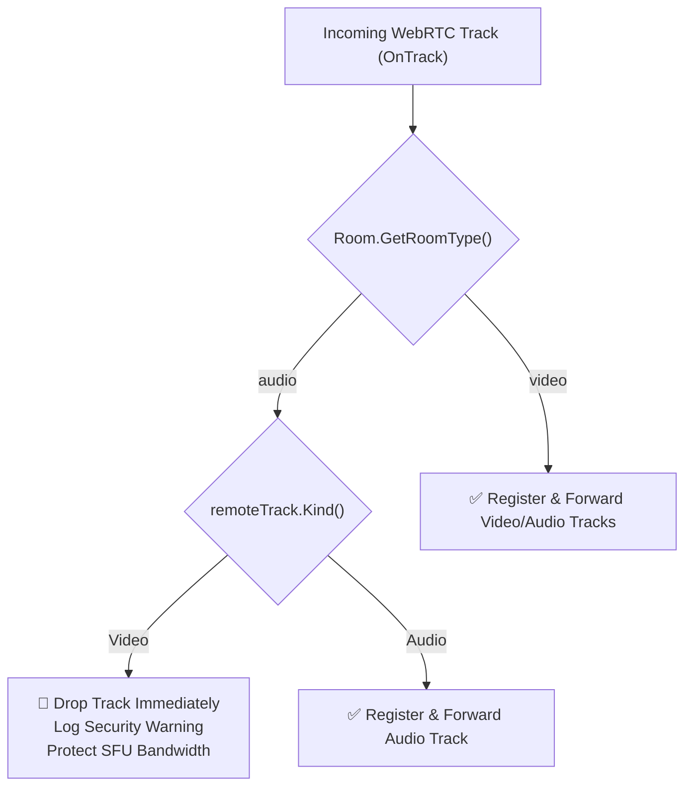
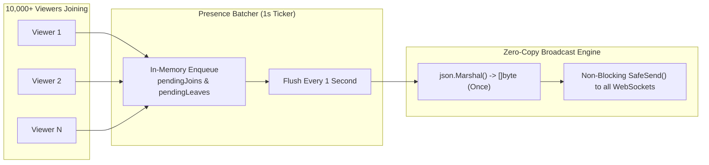

# 🚀 OmniCast Engine — Enterprise Go WebRTC SFU Media Server

A high-performance, ultra-low latency (<300ms) **WebRTC SFU (Selective Forwarding Unit)** live streaming media server built in **Go (Pion WebRTC + Fiber v2 + Redis)**. Designed for massive scalability (10k+ concurrent viewers per room, 100k+ horizontally clustered), interactive live streaming, multi-guest co-hosting, live PK battles, and distributed edge cascading.

---

## 📑 সূচিপত্র (Table of Contents)
1. [🌟 মূল ফিচার ও ক্যাপাবিলিটি (Key Capabilities)](#-মূল-ফিচার-ও-ক্যাপাবিলিটি-key-capabilities)
2. [🏗️ আর্কিটেকচার ও ডেটা ফ্লো ডায়াগ্রাম (System Architecture)](#️-আর্কিটেকচার-ও-ডেটা-ফ্লো-ডায়াগ্রাম-system-architecture)
3. [⚔️ Live PK Battle ক্রস-রাউটিং মেকানিজম (PK Battle Engine)](#️-live-pk-battle-ক্রস-রাউটিং-মেকানিজম-pk-battle-engine)
4. [🎙️ অডিও-অনলি ও ভিডিও রুম ফিল্টারিং (Room Types & Strict Security)](#️-অডিও-অনলি-ও-ভিডিও-রুম-ফিল্টারিং-room-types--strict-security)
5. [⚡ 10k+ ভিউয়ার স্কেলিং ও অপ্টিমাইজেশন (Extreme Performance Optimizations)](#-10k-ভিউয়ার-স্কেলিং-ও-অপ্টিমাইজেশন-extreme-performance-optimizations)
6. [🌐 100k+ ডিস্ট্রিবিউটেড ক্লাস্টারিং ও লোড ব্যালেন্সিং (Horizontal Scaling)](#-100k-ডিস্ট্রিবিউটেড-ক্লাস্টারিং-ও-লোড-ব্যালেন্সিং-horizontal-scaling)
7. [🔒 সিকিউরিটি ও JWT অথেনটিকেশন (Zero-Trust Security)](#-সিকিউরিটি-ও-jwt-অথেনটিকেশন-zero-trust-security)
8. [📡 সিগন্যালিং প্রোটোকল ও ইভেন্ট রেফারেন্স (Complete Signaling Protocol)](#-সিগন্যালিং-প্রোটোকল-ও-ইভেন্ট-রেফারেন্স-complete-signaling-protocol)
9. [🔌 ক্লায়েন্ট ইন্টিগ্রেশন গাইড (Flutter, Web, React Native, iOS, Android)](#-ক্লায়েন্ট-ইন্টিগ্রেশন-গাইড)
10. [⚙️ কনফিগারেশন, ডকার ও ডেপ্লয়মেন্ট (Setup & Deployment)](#️-কনফিগারেশন-ডকার-ও-ডেপ্লয়মেন্ট-setup--deployment)
11. [🧪 টেস্টিং ও কোড কভারেজ (Testing & Verification)](#-টেস্টিং-ও-কোড-কভারেজ-testing--verification)

---

## 🌟 মূল ফিচার ও ক্যাপাবিলিটি (Key Capabilities)

### 1. আল্ট্রা-লো লেটেন্সি WebRTC SFU মিডিয়া ইঞ্জিন
- **Pion WebRTC 3.x:** VP8, H.264 ভিডিও কোডেক এবং Opus অডিও কোডেক সহ সাব-সেকেন্ড (<300ms) লেটেন্সি।
- **Multi-SSRC Keyframe (PLI) Dispatch:** ভিউয়ার জয়েন করার সাথে সাথে ডেটামোশিং ও ভিডিও ফ্রিজ রোধে মাল্টি-বার্স্ট RTCP PLI কি-ফ্রেম ইনজেকশন।
- **Adaptive Simulcast & Dynamic Layer Switching:** ক্লায়েন্টের নেটওয়ার্ক ব্যান্ডউইথ অনুযায়ী `'f'` (Full HD), `'h'` (Half HD), `'q'` (Quarter HD) লেয়ার পরিবর্তন।

### 2. মাল্টি-গেস্ট / কো-হোস্টিং সিট ম্যানেজমেন্ট
- **Seamless WebRTC Renegotiation:** ভিউয়ার যখন কো-হোস্টে উন্নীত হয়, তখন তার বিদ্যমান `PeerConnection` ক্লোজ না করে সরাসরি অন-দ্য-ফ্লাই নতুন ট্র্যাক যোগ করে রিনগোসিয়েশন সম্পন্ন হয়।
- **মেইন স্টেজ প্রমোশন:** যেকোনো কো-হোস্টকে এক ক্লিকে মেইন স্টেজে পিন করার ডায়নামিক সুইচিং।
- **অ্যাক্টিভ সিট লিমিট ও কনফিগ:** আনলিমিটেড বা কনফিগারেবল কো-হোস্ট সিট স্লট।

### 3. লাইভ পিকে ব্যাটল ইঞ্জিন (Live PK Battles)
- **রিয়েল-টাইম ক্রস-রাউটিং:** Room A (Host A) এবং Room B (Host B)-এর মিডিয়া স্ট্রিম স্বয়ংক্রিয়ভাবে ক্রস-রিলে হয়ে উভয় রুমের দর্শকদের স্ক্রিনে স্প্লিট-ভিউ প্রদর্শন করে।
- **রিয়েল-টাইম স্কোর সিঙ্ক:** কোনো রুমে গিফট পাঠানো হলে উভয় রুমের স্ক্রিনে ইনস্ট্যান্ট স্কোর ও প্রগ্রেস বার সিঙ্ক হয়।

### 4. গিফট ইকোনমি ও স্কোর সিস্টেম
- **অ্যাটমিক ব্যালেন্স আপডেট:** ইন-মেমোরি ও Redis Pipeline-এর মাধ্যমে মিলি-সেকেন্ডে কয়েন/স্কোর আপডেট।
- **`gift_processed` ইভেন্ট ব্রডকাস্ট:** অ্যানিমেশন ও ইউজার ব্যালেন্স ট্রিগার করার জন্য রুমের সব ক্লায়েন্টে ব্রডকাস্ট।

### 5. ডাইনামিক ইউজার মেটাডাটা (No Backend Code Change Needed)
- ইউজার লেভেল, ভিআইপি ব্যাজ, কাস্টম ফ্রেম, স্পেশাল ট্যাগ ইত্যাদি পাঠাতে ব্যাকএন্ডে কোনো প্রকার কোড চেঞ্জ ছাড়াই ডাইনামিক `metadata: map[string]interface{}` সাপোর্ট।

### 6. ভিডিও বনাম অডিও-অনলি রুম সিকিউরিটি ফিল্টারিং
- `room_type: "audio"` রুমে কোনো ক্লায়েন্ট ভিডিও ট্র্যাক পাঠানোর চেষ্টা করলে সার্ভার WebRTC `OnTrack` লেভেলে তা ড্রপ করে ব্যান্ডউইথ সেভ করে।

### 7. এন্টারপ্রাইজ স্কেলিং ও মেমোরি ম্যানেজমেন্ট
- **Presence Batching:** প্রতি ১ সেকেন্ডে জয়েন/লিভ ইভেন্ট ব্যাচ আকারে ব্রডকাস্ট করে 10k+ ভিউয়ারে CPU Spike মুক্ত পারফরম্যান্স।
- **Zero-Allocation JSON Broadcast Caching:** ব্রডকাস্ট পেলোড মাত্র একবার মার্শাল করে র-বাইট সব সকেটে ডিসপ্যাচ।
- **Zombie Connection Cleanup:** অন-আইস কানেকশন স্টেট ফেইল্ড হলে তাৎক্ষণিক মেমোরি রিলিজ ও রিসোর্স ক্লিনআপ।

---

## 🏗️ আর্কিটেকচার ও ডেটা ফ্লো ডায়াগ্রাম (System Architecture)



---

## ⚔️ Live PK Battle ক্রস-রাউটিং মেকানিজম (PK Battle Engine)



---

## 🎙️ অডিও-অনলি ও ভিডিও রুম ফিল্টারিং (Room Types & Strict Security)



- **`RoomType` Support:** প্রতিটি রুমে `"video"` অথবা `"audio"` টাইপ ডিফাইন করা থাকে।
- **Zero-Waste SFU Bandwidth:** অডিও রুমে ক্লায়েন্ট ক্যামেরা অন করার চেষ্টা করলে সার্ভার WebRTC `OnTrack` লেভেলেই ভিডিও ফ্রেমগুলো ড্রপ করে দেয়।

---

## ⚡ 10k+ ভিউয়ার স্কেলিং ও অপ্টিমাইজেশন (Extreme Performance Optimizations)



1. **Event Batching & Throttling:** প্রতি সেকেন্ডে ১০০ জন ইউজার জয়েন করলে পৃথক ১০০টি ইভেন্টের পরিবর্তে ১টি কনসোলিডেটেড `presence_update` ইভেন্ট ব্রডকাস্ট হয়।
2. **Zero-Allocation JSON Broadcast Caching:** ব্রডকাস্ট পেলোড লুপের ভেতর বারবার মার্শাল না করে একবার `[]byte`-এ রূপান্তর করে সরাসরি সব ক্লায়েন্টের নন-ব্লকিং চ্যানেলে পাঠানো হয়।
3. **Adaptive Dynamic Layer Switching (`request_layer`):** ভিউয়ার তার ডিসপ্লে সাইজ অনুযায়ী গ্রিড ভিউতে লোয়ার লেয়ার (`'q'`) এবং ফুল স্ক্রিন ভিউতে ফুল এইচডি (`'f'`) রিকোয়েস্ট করতে পারে।

---

## 🌐 100k+ ডিস্ট্রিবিউটেড ক্লাস্টারিং ও লোড ব্যালেন্সিং (Horizontal Scaling)

### Nginx কনফিগারেশন (`nginx.conf`)
```nginx
upstream omnicast_sfu_cluster {
    ip_hash; # Sticky sessions based on IP
    server sfu-node-1.internal:8080 max_fails=3 fail_timeout=10s;
    server sfu-node-2.internal:8080 max_fails=3 fail_timeout=10s;
    server sfu-node-3.internal:8080 max_fails=3 fail_timeout=10s;
    keepalive 512;
}

server {
    listen 443 ssl http2;
    server_name live.yourdomain.com;

    location /ws {
        proxy_pass http://omnicast_sfu_cluster;
        proxy_http_version 1.1;
        proxy_set_header Upgrade $http_upgrade;
        proxy_set_header Connection "Upgrade";
        proxy_set_header Host $host;
        proxy_read_timeout 86400s;
        proxy_send_timeout 86400s;
        proxy_buffering off;
    }
}
```

---

## 🔒 সিকিউরিটি ও JWT অথেনটিকেশন (Zero-Trust Security)

- **WebSocket Interceptor:** প্রতিটি `/ws?token=ey...` কানেকশন খোলার আগেই ক্রিপ্টোগ্রাফিকভাবে ভ্যালিডেট হয়।
- **Zero-Trust Claims:** টোকেনের ভেতরের `user_id`, `room_id`, `role`, `display_name`, `avatar_url`, `metadata` সরাসরি সেশনের অথেনটিক আইডেন্টিটি হিসেবে সেট হয়। আন-ভেরিফাইড ক্লায়েন্ট JSON-এর ওপর কোনো নির্ভরতা নেই।

---

## 📡 সিগন্যালিং প্রোটোকল ও ইভেন্ট রেফারেন্স (Complete Signaling Protocol)

### ১. রুম ক্রিয়েশন ও পাবলিশিং (`create_room` / `publish`)
```json
{
  "event": "create_room",
  "room_id": "live-101",
  "room_name": "Tech Talk Live",
  "room_type": "video",
  "display_name": "Alice Host",
  "avatar_url": "https://cdn.example.com/alice.png",
  "metadata": {
    "level": 99,
    "badge": "VIP_PLATINUM",
    "vip_frame": "crown_frame.svg"
  },
  "payload": {
    "sdp": "v=0\r\no=- 123456 ...",
    "type": "offer"
  }
}
```

### ২. ভিউয়ার জয়েনিং (`join_room` / `play`)
```json
{
  "event": "join_room",
  "room_id": "live-101",
  "display_name": "Bob Viewer",
  "avatar_url": "https://cdn.example.com/bob.png",
  "metadata": {
    "level": 42,
    "badge": "VIP_GOLD"
  },
  "payload": {
    "sdp": "v=0\r\no=- 789012 ...",
    "type": "offer"
  }
}
```

### ৩. লেট-জয়েনার স্টেট সিঙ্ক (`room_info_sync`)
```json
{
  "event": "room_info_sync",
  "room_id": "live-101",
  "payload": {
    "room_id": "live-101",
    "room_name": "Tech Talk Live",
    "room_type": "video",
    "host_id": "host-alice",
    "total_viewers": 10420,
    "host_score": 54000,
    "active_seats": { "0": "host-alice", "1": "cohost-charlie" },
    "media_states": { "host-alice": { "muted_audio": false, "muted_video": false } },
    "pk_state": { "is_active": false },
    "participants": [
      {
        "user_id": "viewer-bob",
        "display_name": "Bob Viewer",
        "avatar_url": "https://cdn.example.com/bob.png",
        "role": "viewer",
        "metadata": { "level": 42, "badge": "VIP_GOLD" }
      }
    ]
  }
}
```

### ৪. ব্যাচড প্রেজেন্স আপডেট (`presence_update`)
```json
{
  "event": "presence_update",
  "room_id": "live-101",
  "total_viewers": 10421,
  "payload": {
    "joined": [
      {
        "user_id": "viewer-new",
        "display_name": "New User",
        "avatar_url": "https://cdn.example.com/new.png",
        "role": "viewer",
        "metadata": { "level": 12 }
      }
    ],
    "left": [ "viewer-old" ],
    "total_viewers": 10421,
    "viewers": [ ... ]
  }
}
```

### ৫. গিফট প্রসেসড (`gift_processed`)
```json
{
  "event": "gift_processed",
  "room_id": "live-101",
  "sender_id": "viewer-bob",
  "gift_id": "space_rocket",
  "coins": 1000,
  "points_added": 1000,
  "new_score": 55000,
  "host_id": "host-alice"
}
```

### ৬. ডাইনামিক কোয়ালিটি লেয়ার সুইচিং (`request_layer`)
```json
{
  "event": "request_layer",
  "room_id": "live-101",
  "payload": {
    "target_user": "host-alice",
    "layer": "q"
  }
}
```
*(সাপোর্টেড লেয়ার: `'f'` = Full HD 1080p/720p, `'h'` = Half HD 480p, `'q'` = Quarter 240p/180p)*

---

## 🔌 ক্লায়েন্ট ইন্টিগ্রেশন গাইড (Client SDK Integration)

### ১. Flutter SDK (`omnicast_client`)
```dart
import 'package:omnicast_client/omnicast_client.dart';

final client = OmnicastClient(
  serverUrl: 'wss://live.yourdomain.com/ws',
  token: jwtToken,
);

// Listen to authoritative state snapshot
client.onRoomInfoSync.listen((RoomState state) {
  print('Room Type: ${state.roomType}');
  print('Viewers: ${state.totalViewers}');
  print('Participants: ${state.participants.length}');
  print('PK Active: ${state.pkState?.isActive}');
});

// Join live room with profile & dynamic metadata
await client.joinRoom(
  roomId: 'live-101',
  displayName: 'Rahim Khan',
  avatarUrl: 'https://cdn.example.com/avatar.png',
  metadata: {
    'level': 50,
    'badge': 'VIP_GOLD',
    'vip_frame': 'dragon_frame.svg',
  },
);

// Send gift & trigger animation
await client.sendGift(
  giftId: 'space_rocket',
  coins: 1000,
);

// Adaptive layer switching
client.requestLayer(layer: 'q'); // 'f' (1080p), 'h' (480p), 'q' (240p)
```

---

### ২. JavaScript / Web SDK (`public/sdk/live_media_sdk.js`)
```javascript
import { LiveMediaSDK } from './sdk/live_media_sdk.js';

const client = new LiveMediaSDK({
  wsUrl: 'wss://live.yourdomain.com/ws',
  token: jwtToken,
});

client.on('room_info_sync', (state) => {
  console.log('Room State:', state);
});

client.on('pk_score_update', (scoreData) => {
  console.log('PK Score:', scoreData);
});

// Start watching as viewer
await client.joinRoom('live-101', {
  displayName: 'Web User',
  metadata: { level: 10 }
});
```

---

## 🌐 REST API Endpoints

| মেথড | এন্ডপয়েন্ট | বিবরণ |
|---|---|---|
| `GET` | `/health` | সার্ভারের স্বাস্থ্য ও সক্রিয় রুমের সংখ্যা যাচাই করে। |
| `GET` | `/api/ice-servers` | ক্লায়েন্টের জন্য ডাইনামিক STUN/TURN ক্রেডেনশিয়াল প্রদান করে। |
| `GET` | `/auth/demo-token?user_id=...&role=...&room_id=...` | টেস্টিংয়ের জন্য সাইন করা JWT টোকেন তৈরি করে। |
| `GET` | `/rooms` | বর্তমানে সক্রিয় সব রুম ও ভিউয়ার সংখ্যার তালিকা। |
| `GET` | `/room/:id` | নির্দিষ্ট একটি রুমের বিস্তারিত সারাংশ। |
| `GET` | `/api/admin/rooms` | সিকিউরড অ্যাডমিন ড্যাশবোর্ড স্ট্যাটাস ও সেশন আপটাইম (`X-API-Key`)। |
| `POST` | `/api/admin/rooms/:id/end` | অ্যাডমিন কিল-সুইচ (রুম তৎক্ষণাৎ ক্লোজ ও মেমোরি ওয়াইপ)। |
| `WS`  | `/ws?token=JWT_TOKEN` | রিয়েলটাইম সিগন্যালিং ও WebRTC নেগোসিয়েশন সকেট। |

---

## ⚡ সার্ভার রান এবং ডেপ্লয়মেন্ট গাইড (Running & Deployment)

### পদ্ধতি ১: লোকাল মেশিনে রান করা (Go)
```bash
# ডিপেন্ডেন্সি ডাউনলোড করুন
go mod tidy

# সার্ভার স্টার্ট করুন
go run cmd/main.go
```
সার্ভারটি চালু হলে ব্রাউজারে `http://localhost:8080` ওপেন করলে বিল্ট-ইন টেস্ট UI দেখতে পাবেন।

---

### পদ্ধতি ২: Docker Compose দিয়ে ক্লাস্টার রান করা (Redis + Server)
প্রোডাকশনে ক্লাস্টারিং এবং ফুল স্ট্যাক এক কমান্ডে চালানোর জন্য:

```bash
docker-compose up -d --build
```

### পদ্ধতি ৩: Docker Hub Production Release
```bash
# ইউনিট টেস্ট, মাল্টি-আর্কিটেকচার ডকার বিল্ড ও ডকার হাবে পুশ
make release
```

### পরিবেশের চলকসমূহ (Environment Variables):

| ভেরিয়েবল | ডিফল্ট মান | বিবরণ |
|---|---|---|
| `PORT` | `8080` | HTTP ও WebSocket লিসেনিং পোর্ট |
| `PUBLIC_IP` | `127.0.0.1` | WebRTC ICE হোস্ট ক্যান্ডিডেটের পাবলিক/লোকাল আইপি |
| `REDIS_ADDR` | `localhost:6379` | মাল্টি-সার্ভার ক্লাস্টারিং ও Pub/Sub-এর জন্য Redis ঠিকানা |
| `JWT_SECRET` | `default_secret` | JWT ভ্যালিডেশনের গোপন চাবি |
| `SERVER_SECRET` | `cascade_key` | ইন্টার-সার্ভার SFU Cascading বাইপাস চাবি |
| `WEBHOOK_URL` | *(ঐচ্ছিক)* | রিয়েল-টাইম ইভেন্ট পোস্ট করার জন্য আপনার মূল ব্যাকএন্ড URL |
| `WEBHOOK_SECRET`| *(ঐচ্ছিক)* | HMAC SHA-256 সিগনেচার ভেরিফিকেশন চাবি |
| `SERVER_ROLE` | `origin` | সার্ভার নোডের ভূমিকা (`origin` অথবা `edge`) |

---

## 🧪 টেস্টিং ও কোড কভারেজ (Testing & Verification)

সম্পূর্ণ মিডিয়া সার্ভারের ইউনিট টেস্ট ও ইন্টিগ্রেশন টেস্ট চালাতে:

```bash
# সব প্যাকেজের টেস্ট চালান
make test
```

### টেস্ট ফলাফল:
```
PASS: TestRoomCoHostTracks
PASS: TestRoomSimulcastTracks
PASS: TestRoomState
PASS: TestRoomTypeAndStateSync
PASS: TestRoomParticipantsAndPresence
PASS: TestRoomTrackSwitcherRegistry
PASS: TestPKManager (Cross-Routing & Score Sync)
PASS: TestRoomStateSyncAndGiftScore (Gift Economy)
PASS: TestSeatManagementLifecycle
PASS: TestPKBattleFullLifecycle
PASS: TestViewerUpdateEvent (Batched Presence)
PASS: TestAuthHandler_TokenGeneration
PASS: TestWebhookDispatcher
ok  	omnicast/internal/models	0.601s
ok  	omnicast/internal/signaling	2.657s
ok  	omnicast/internal/webrtc	1.443s
```

---

## 📄 লাইসেন্স (License)

MIT License © 2026 OmniCast Engine Team. Open-source and free for commercial and personal usage.
